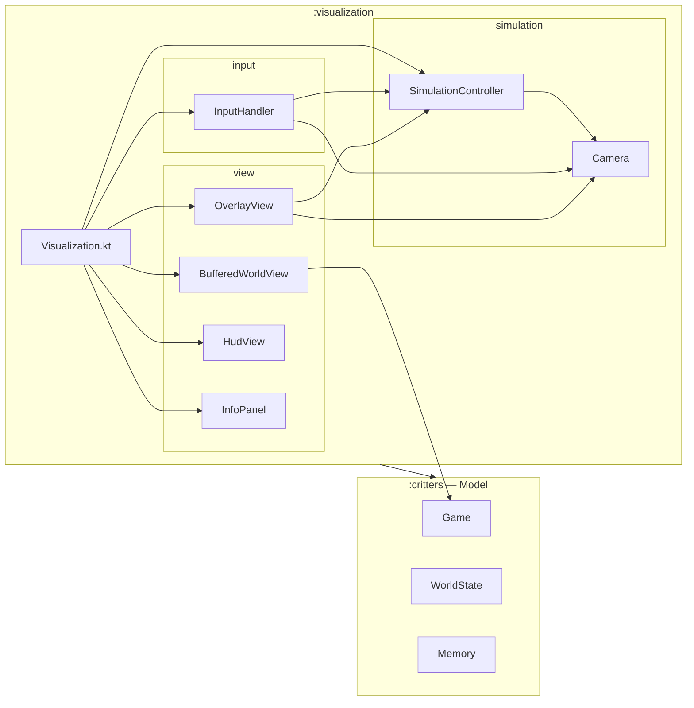

# Architecture Spine — Critter Plains — Visualization & Interaction Controls

## Design Paradigm

Game-loop MVC, unchanged from the existing project:

- **Model** — `:critters` (`Game`, `WorldState`, `Critter`, `Memory`). Zero UI dependency, zero OPENRNDR types. `[ADOPTED — existing project rule, AGENTS.md.]`
- **Controller** — `:visualization/simulation` (`SimulationController` + the new `Camera`). Bridges OPENRNDR's per-frame clock to the model, owns interaction state (pause, Speed Tier, selection).
- **View** — `:visualization/view`, drawn in layers each frame: world buffer → blit → overlay pass → side panel. `:visualization/input` translates raw input into Controller/Camera calls; it does not render.

## Invariants & Rules

### AD-1 — Camera owns viewport position, zoom, and all world↔screen transform math

- **Binds:** FR-1, FR-2, FR-6, FR-7
- **Prevents:** Pan, zoom, recenter, and the selection indicator each computing their own tile↔pixel math and drifting apart. Today's `cellSize` is a `val` baked into three separate classes — that's the exact failure mode this closes.
- **Rule:** A single `Camera` (package `simulation`) is the only owner of viewport position and zoom scale. `SimulationController` composes a `Camera` instead of holding `viewportX`/`viewportY`/`cellSize` itself. Every world↔screen conversion anywhere in `:visualization` (world-buffer draw loop, click→`Position` mapping, recenter math, indicator projection) calls into this one `Camera` — no consumer computes tile↔pixel scale independently. Concretely, `BufferedWorldView.render()` reads `Camera`'s live zoom scale (a plain scalar, e.g. `camera.cellSize`) at the top of every call and sizes its tile `rectangle(...)` draws from it — this is world-geometry (what size is a tile), not selection/UI state, and is not a widening of AD-2's ban (see AD-2's exception clause). Zoom exposes a single `zoomAt(anchorScreenPos: Vector2, factor: Double)` entry point: scroll-wheel zoom calls it with the cursor position, key-based zoom calls it with the viewport center — one mechanism, two callers, resolving PRD Open Question 2 by construction. Exact zoom bounds/step size and the exact zoom key pair (PRD Open Questions 1, 3) stay implementation detail owned entirely by `Camera` — no cross-unit divergence risk regardless of the chosen numbers.
  **Screen-space convention:** every `Vector2` `Camera` accepts or returns (including `zoomAt`'s `anchorScreenPos` and the FR-7 indicator's edge-clamp math) is relative to the **map viewport's own rectangle** — origin `(0,0)` at the map's top-left, sized `viewportWidthPx × viewportHeightPx` — never the full OPENRNDR window. Today these coincide only because `InfoPanel` sits to the *right* of that rectangle; `Camera` does not know the panel exists. Any caller holding a raw OPENRNDR window/mouse coordinate (e.g. `mouse.position`, `mouse.scrolled`'s `position`) must confirm it falls within `[0, viewportWidthPx) × [0, viewportHeightPx)` before passing it to `Camera` — clicks/scrolls over the panel are out of `Camera`'s domain, not silently clamped into it.
  **Zoom-application strategy:** the off-screen `RenderTarget` `BufferedWorldView` draws into keeps its fixed pixel dimensions (`viewportWidthPx × viewportHeightPx`) regardless of zoom — zoom changes how many tiles fit and how large each tile's `rectangle(...)` is drawn, not the buffer's own size. This is a redraw-at-current-scale, not a scaled blit of stale content: since `BufferedWorldView.render()` already runs unconditionally every frame in today's `extend {}` loop, redrawing at the live `cellSize` costs nothing extra. `OverlayView` (AD-2) must derive its own tile↔pixel math from this same live-`cellSize`-into-fixed-buffer model — never from an assumed fixed-base-resolution-plus-scaled-blit alternative.

### AD-2 — UI overlays render as a pass separate from the world buffer

- **Binds:** FR-5, FR-7, FR-10, FR-11
- **Prevents:** The world-render contract absorbing UI/interaction state. `BufferedWorldView` today takes only `World` (ground truth) — folding `selectedCritter` or Camera state into it would make "what does this class render" ambiguous for the next feature that wants to draw something on the map.
- **Rule:** `BufferedWorldView` keeps rendering only sim ground truth (terrain + critter occupancy) into its off-screen buffer — no selection state, no overlay drawing added to its signature. Memory tint (FR-5), the selection indicator (FR-7), and the pause/tier badges (FR-10, FR-11) render in a new `OverlayView` (package `view`), drawn directly to screen *after* the world buffer is blitted, reading live state from `Camera` and `SimulationController` each frame. `HudView`'s existing mouse-hover tooltip is unaffected — it already draws to screen post-blit and stays as-is. **Narrow exception (see AD-1):** `BufferedWorldView` may read `Camera`'s live zoom scale — a single scalar controlling tile draw size — each `render()` call; that is world geometry, not selection/UI state, and does not make it selection-aware. It still takes no `selectedCritter`, no viewport position beyond what it already needs to know which tiles are visible, and draws no overlay content.
  **Draw order within `OverlayView`, fixed:** memory tint → selection indicator → pause/tier badges. Tint is world-space annotation (drawn first, lowest); badges are fixed UI chrome (drawn last, always on top, never occluded).
  **Drawer-state hygiene:** each of `OverlayView`'s three sub-passes (tint, indicator, badges) resets every `Drawer` property it uses (`fill`, `stroke`, `strokeWeight`) at its own entry point — matching the existing convention already visible in `BufferedWorldView`/`InfoPanel` (each sets `stroke`/`fill` at the top of its own `render()`). No sub-pass may rely on `Drawer` state left by whichever sub-pass ran before it.

### AD-3 — Speed Tier is first-class state; tick interval is derived from it

- **Binds:** FR-8, FR-9, FR-11
- **Prevents:** FR-11's indicator having to reverse-derive "which tier is active" from a raw fps/interval float, and the `Int`-fps rounding problem a straight 0.5×/1×/2× multiplier would otherwise hit (PRD Open Question 4).
- **Rule:** `SimulationController` tracks an explicit `SpeedTier` (`SLOW(0.5)`, `NORMAL(1.0)`, `FAST(2.0)` — multiplier per tier). `updateInterval` (already `Double`) is computed as `baseInterval / tier.multiplier`, never the reverse. `baseInterval` seeds from the existing `initialFps: Int` constructor parameter exactly as today's `updateInterval` does (`1.0 / initialFps`) — only the multiplier layer is new. `FR-11`'s indicator reads `controller.speedTier` directly — no comparison against a float. Default on startup is `NORMAL`, matching the existing default tick rate exactly. The tier↔display-text mapping (`SLOW`→`"1"`, `NORMAL`→`"2"`, `FAST`→`"3"`) lives once, as a property on `SpeedTier` itself — `FR-9`'s key handler and `FR-11`'s badge both read it from there; neither maintains its own copy.

### AD-4 — Continuous input is polled from OPENRNDR's built-in KeyTracker, not hand-rolled or GLFW key-repeat

- **Binds:** FR-1
- **Prevents:** Hold-to-pan stuttering with an OS-repeat initial-delay-then-cadence pattern, and any future hold-driven input feature inventing its own tracking mechanism when the framework already ships one.
- **Rule:** `InputHandler` uses OPENRNDR's own `org.openrndr.KeyTracker(keyEvents)` (`[web-verified against openrndr/openrndr source at the pinned v0.4.5 tag, `Keys.kt`: ships a `KeyTracker` class alongside `Keyboard` in the same module, exposing `pressedKeys: Set<String>` — Keyboard itself has no such property, only discrete `keyDown`/`keyUp`/`keyRepeat`/`character` events]`), polling its `pressedKeys` once per frame in the `extend {}` loop to drive `Camera.pan()` continuously — not via `keyRepeat` (unsuitable: initial-delay + fixed-cadence stutter, not smooth) and not via a hand-rolled `Set`. Note `pressedKeys` is keyed by key **name** (`String`, e.g. `"W"`), not the `Int` key codes the existing discrete `keyDown` handlers compare against — the two identification schemes coexist; only the continuous/held path uses `KeyTracker`'s string names. Discrete actions — select click, `Escape` deselect, spacebar pause, `1`/`2`/`3` tier switch, `C` recenter, scroll-wheel zoom (`mouse.scrolled`, carries `rotation` as delta), **and key-based zoom (`+`/`-`)** — stay event-driven exactly as today, unchanged. Key-based zoom is explicitly **not** added to `KeyTracker`'s held-key poll set: it fires one `zoomAt()` step per discrete `keyDown`, matching the scroll wheel's inherently per-notch (not continuous) granularity — this also forecloses the double-fire risk of the same key being read by both the discrete handler and the continuous poll.

### AD-5 — Selection is re-resolved live every tick via an identity-keyed lookup, and auto-clears when that lookup comes back dead or missing

- **Binds:** FR-3, FR-4, FR-5, FR-6, FR-7
- **Prevents:** (a) FR-5's tint, FR-6's recenter, and FR-7's indicator each needing to know the selected critter's *current* tile as it moves tick-to-tick, when today's only lookup (`GameStateView.occupant(pos)`) is position-keyed and `selectedCritter` is a one-shot snapshot from click time that's never refreshed — without a shared fix, each of those three features would otherwise invent its own (likely fragile, position-search-based) way to re-find "where is my critter now." (b) The panel, tint, recenter target, and indicator arrow all pointing at/highlighting a critter that has died — a stale-reference bug across four features at once if each handled death independently.
- **Rule:** `GameStateView` (`:critters`, `StateView.kt`) gains one narrow, additive, read-only lookup: `fun critter(name: CritterName): CritterStateView?`, identity-keyed. This is the epic's one explicit exception to "does not touch `:critters`" — no new mutation surface, no OPENRNDR/UI type crosses the boundary, `:critters` remains dependency-free of `:visualization`. `SimulationController.update()` calls this lookup to re-resolve `selectedCritter` immediately after every `game.tick()` — not just at click time. If the lookup returns `null` (critter removed) or a `CritterStateView` with `isDead == true`, selection clears exactly as FR-4's manual deselect does. This single call site is the *only* place anything checks "is my selection still valid" — `OverlayView` (tint, indicator), `InfoPanel`, and the `C` recenter handler are all pure readers of `SimulationController.selectedCritter`, rendering/acting on nothing when it's `null`. Resolves PRD Open Question 5.

### Dependency direction



`:critters` has no outgoing edge into `:visualization` — the existing boundary from AGENTS.md holds unchanged.

## Consistency Conventions

| Concern | Convention |
| --- | --- |
| Naming | New types: `Camera` (package `simulation`), `OverlayView` (package `view`), `SpeedTier` (enum, package `simulation`). Matches existing `*Controller`/`*View` naming already in the codebase. |
| State & cross-cutting | Camera and Speed Tier are mutable state owned by exactly one class each (`Camera`, `SimulationController`); no other class holds a shadow copy. Selection-dependent rendering (`OverlayView`) reads `controller.selectedCritter` fresh every frame — never caches it. |
| Rendering (OPENRNDR `Drawer`) | Every `render()` and every internal sub-pass resets the `Drawer` properties it uses (`fill`, `stroke`, `strokeWeight`) at its own entry — see AD-2. No draw call relies on state left by whatever drew before it. |

## Structural Seed

```text
critters/src/main/kotlin/
  StateView.kt              # MODIFIED — GameStateView gains critter(name): CritterStateView? (AD-5, narrow exception)

visualization/src/main/kotlin/
  Visualization.kt           # MODIFIED — constructs Camera + OverlayView, wires scroll listener, invokes per-frame held-key poll
  simulation/
    Camera.kt              # NEW — viewport position, zoom, world<->screen transforms
    SimulationController.kt  # MODIFIED — composes Camera; owns SpeedTier; re-resolves selectedCritter every tick (AD-5)
  input/
    InputHandler.kt         # MODIFIED — KeyTracker-based held-key polling for hold-to-pan; new bindings (arrows, C, Escape, 1/2/3, zoom keys)
  view/
    BufferedWorldView.kt    # MODIFIED — reads live cellSize from Camera each render() call (AD-1/AD-2 exception); still no selection awareness
    OverlayView.kt           # NEW — memory tint, selection indicator, pause/tier badges
    HudView.kt               # UNCHANGED — mouse-hover tooltip
    InfoPanel.kt              # MODIFIED — clears alongside AD-5 selection lifecycle
```

## Capability → Architecture Map

| Capability | Lives in | Governed by |
| --- | --- | --- |
| FR-1 Hold-to-pan | `Camera`, `InputHandler` | AD-1, AD-4 |
| FR-2 Zoom in/out | `Camera`, `InputHandler` | AD-1 |
| FR-3 Select a critter | `SimulationController` | *(unchanged)* |
| FR-4 Deselect a critter | `SimulationController`, `InputHandler` | AD-5 |
| FR-5 Memory highlight | `OverlayView` | AD-2, AD-5 |
| FR-6 Recenter on selection | `Camera`, `SimulationController` | AD-1, AD-5 |
| FR-7 Selection indicator | `OverlayView`, `Camera` | AD-1, AD-2, AD-5 |
| FR-8 Pause / resume | `SimulationController` | *(unchanged)* |
| FR-9 Speed Tiers | `SimulationController` | AD-3 |
| FR-10 Pause indicator | `OverlayView` | AD-2 |
| FR-11 Speed Tier indicator | `OverlayView` | AD-2, AD-3 |

## Deferred

- Exact zoom min/max bounds and step size (PRD Open Question 1) — owned entirely by `Camera` (AD-1); no cross-unit divergence risk, pick sensible numbers at implementation.
- Exact key pair for key-based zoom, e.g. `+`/`-` (PRD Open Question 3) — same reasoning, single owner in `InputHandler`/`Camera`.
- Deployment, packaging, and environment topology — unchanged by this epic (existing Shadow JAR / `./gradlew run` setup); out of scope.
- OPENRNDR/Kotlin/JVM version pins — unchanged, already fixed project-wide (OPENRNDR 0.4.5, Kotlin 2.0, JVM 17); this epic introduces no new dependency. `[web-verified: OPENRNDR 0.5.0 exists (released 2026-09-16) and deprecates the GLFW backend 0.4.5 uses in favor of SDL3 — noted as a real future tradeoff, deliberately not taken up by this epic.]`
